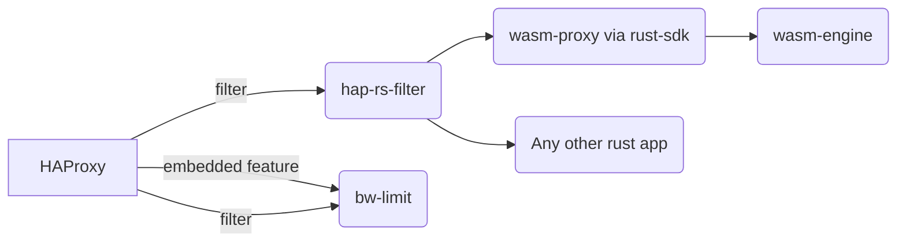

## Introduction

Due to the fact that the SPOE interface does not support body handling and
wasn't adopted for long time.

## Idea

HAProxy have  a quite powerful [filter api](https://github.com/haproxy/haproxy/blob/master/doc/internals/api/filters.txt).
This API makes it possible to jump in into almost every phase of HAProxy
include body manipulation. This raises the idea to create a rust binding
for the [filter api](https://github.com/haproxy/haproxy/blob/master/doc/internals/api/filters.txt).

## Discussion

There is a ml discussion about HAP Filter https://www.mail-archive.com/haproxy@formilux.org/msg44164.html

## Todo

From today's point of view are this the steps which I have seen to do to create
such a binding.

* learn rust
* learn wasm
* learn [cbindgen](https://github.com/mozilla/cbindgen)
  + [A little Rust with your C](https://docs.rust-embedded.org/book/interoperability/rust-with-c.html)
* learn how to combine rust with c and run a automated build
* learn wasm rust-sdk
* test it
* make it maintainable and production ready.

